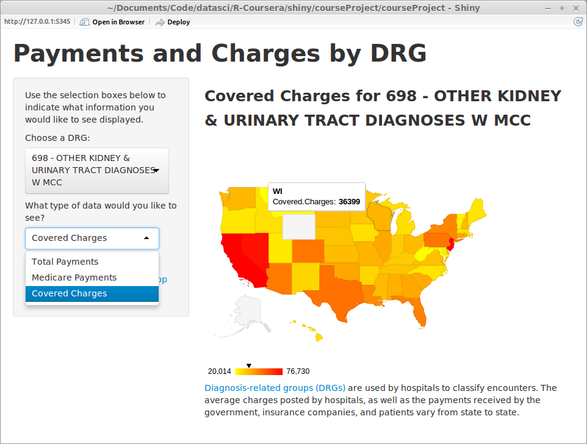

## Background

* In 2012 Centers for Medicare & Medicaid Services CMS released [data it had collected on charges and payments for hospitals across the United States](https://data.cms.gov/Medicare/Inpatient-Prospective-Payment-System-IPPS-Provider/97k6-zzx3/about).
* "The data provided here include hospital-specific charges for the more than 3,000 U.S. hospitals that receive Medicare Inpatient Prospective Payment System (IPPS) payments for the top 100 most frequently billed discharges, paid under Medicare based on a rate per discharge using the Medicare Severity Diagnosis Related Group (MS-DRG) for Fiscal Year (FY) 2011. These DRGs represent more than 7 million discharges or 60 percent of total Medicare IPPS discharges."
* The dataset shows large disparities in charges and payments across the hopsitals that are included.
*  For this project, the data has been aggregated by state to spot regional trends.

--- .class #id 

## Variables Examined

Values represent averages per patient discharged for each DRG.

* Average covered charges
  * The provider's average charge for services covered by Medicare for all discharges in the DRG.  These will vary from hospital to hospital because of differences in hospital charge structures.
* Average total payments
  * The average of Medicare payments to the provider for the DRG including the DRG amount, teaching,  disproportionate share, capital, and outlier payments for all cases. Also included are co-payment and deductible amounts that the patient is responsible for.
* Average Medicare payments
  * The average of Medicare payments to the provider for the DRG without co-payment and deductible amounts that the patient is responsible for.
 

---  .class #id
 
## Example

* Average total charges for DRG 247 - PERC CARDIOVASC PROC W DRUG-ELUTING STENT W/O MCC are $31,141 in South Dakota, but only $11,232 in Alabama.


```r
subset(aggDatState, aggDatState$Provider.State == "SD" & DRG.Definition == 
         "247 - PERC CARDIOVASC PROC W DRUG-ELUTING STENT W/O MCC")[1,4]
```

```
## [1] 31141
```

```r
subset(aggDatState, aggDatState$Provider.State == "AL" & DRG.Definition == 
         "247 - PERC CARDIOVASC PROC W DRUG-ELUTING STENT W/O MCC")[1,4]
```

```
## [1] 11232
```

---

## Screenshot


